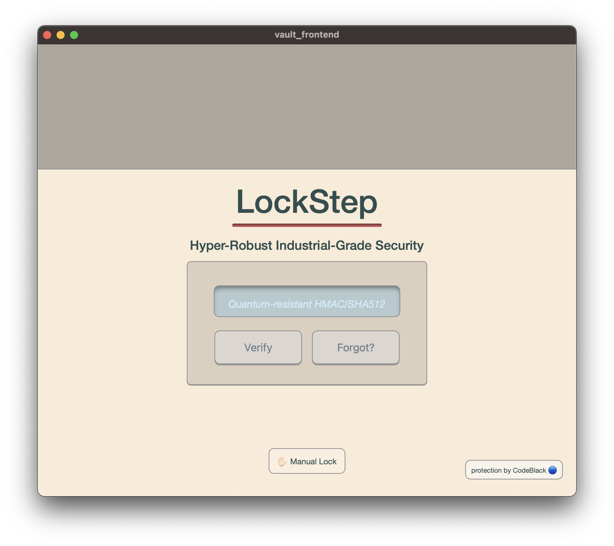
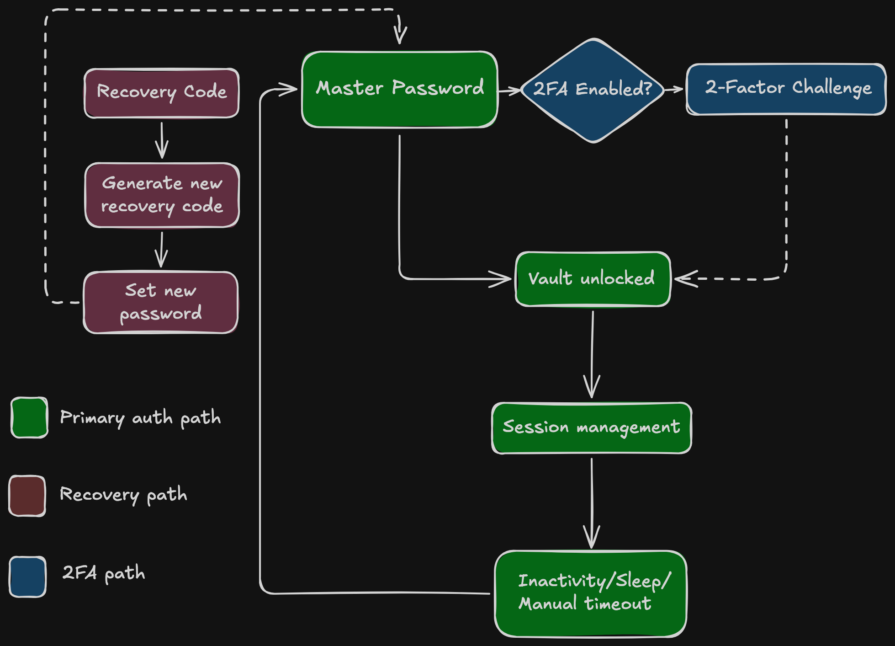
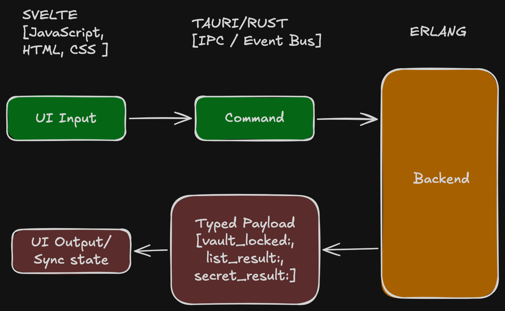

# LockStep Password Vault

> I am loath to trust other people with my sensitive data, especially with all the data breaches that have occurred of late, so I decided to build a password app for myself. While I presently have no intention to make this public, any future release would only happen after extensive third-party testing.

---

## Tech Stack

| Layer | Technology |
|---|---|
| Frontend | Svelte, JavaScript, HTML, CSS |
| Bridge | Tauri (Rust) |
| Backend | Erlang (proprietary — authored by me, not included in this repository) |

---

## 🔒 Security

All sensitive data is encrypted and protected using industry-standard methods.

| Protection | Detail |
|---|---|
| Encryption | AES-256-CTR |
| Key Derivation | PBKDF2-SHA512 · 1,000,000 iterations |
| Integrity Verification | HMAC-SHA512 per entry |
| Salt | 128-bit cryptographically secure random · unique per vault |
| Envelope Encryption | Per-entry Data Encryption Key (DEK) · wrapped by master key |
| IV Generation | Unique 128-bit IV per encrypted field |
| Timing-Safe Comparison | All hash comparisons use constant-time equality |
| 2-Factor Authentication | TOTP (RFC 6238) with backup codes |
| Brute-force Protection | Progressive lockout · hard lock on repeated failures |
| Inactivity Lock | Auto-lock with tiered warnings (green → orange → red) |
| Recovery | Single-use encrypted recovery code · deleted immediately on use |
| Password History | Reuse detection across previous master passwords |
| Password Breach Check | Checks online database for known breached passwords |
| Audit Log | Tamper-evident log of all sensitive operations |
| Core Dump Protection | Disabled at startup on Unix / macOS |
| Security Levels | DEFCON tiered KDF mode · upgradeable to Argon2 |
| Automatic Backup | Vault backed up automatically on master password change |

---

## Architecture

### Auth Flow

### Event & Message Flow

---
## Recently Completed
- **Category assignment** — organisational grouping of vault entries
- **Theme search** — themes surfaced in app-wide search with full keyboard navigation
- **Image addition** — attaching images to vault entries
- **Lucide Icons** - ...to replace system emojis

## In Development
- **Nerd Stats carousel** — expanding the current password strength stat into a rotating panel of vault analytics
- **Silo Mode** - Cloud stash functionality
---

## Testing & Development Status

This project was built for personal use first, with portfolio visibility as a secondary goal. The frontend has been developed and tested through active daily use against a live Erlang backend.

A targeted unit test suite covering payload parsing and frontend security event handling is in progress. Professional third-party penetration testing is planned as the project matures.

This is not a released product. It is a working application and an honest record of where it currently stands.

---

## Licence

[AGPL-3.0](https://www.gnu.org/licenses/agpl-3.0.en.html)
